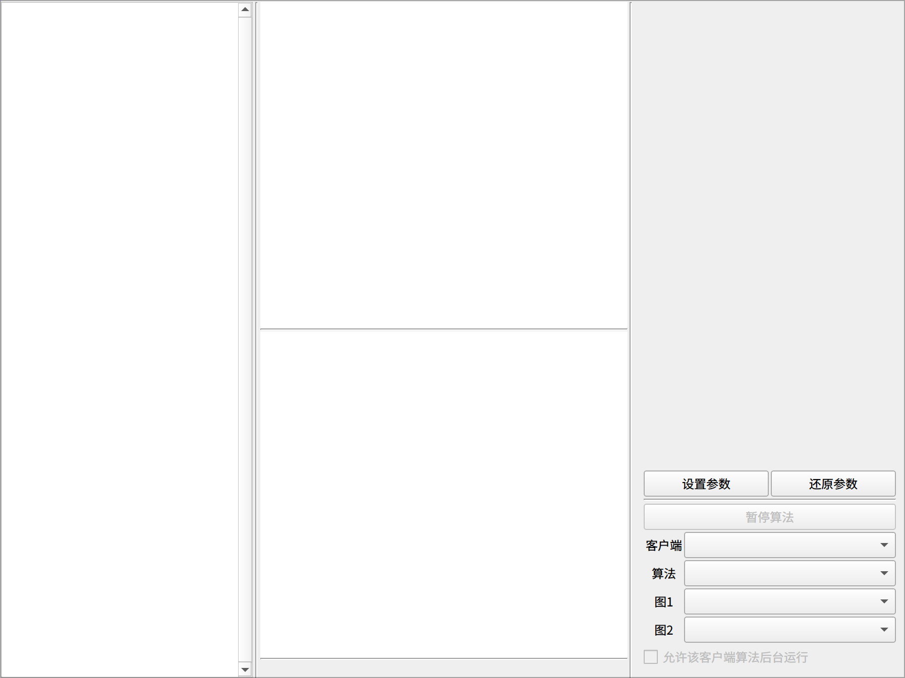
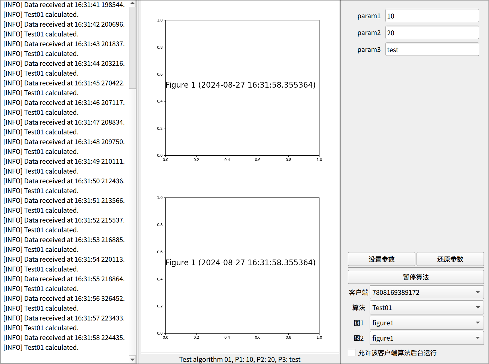
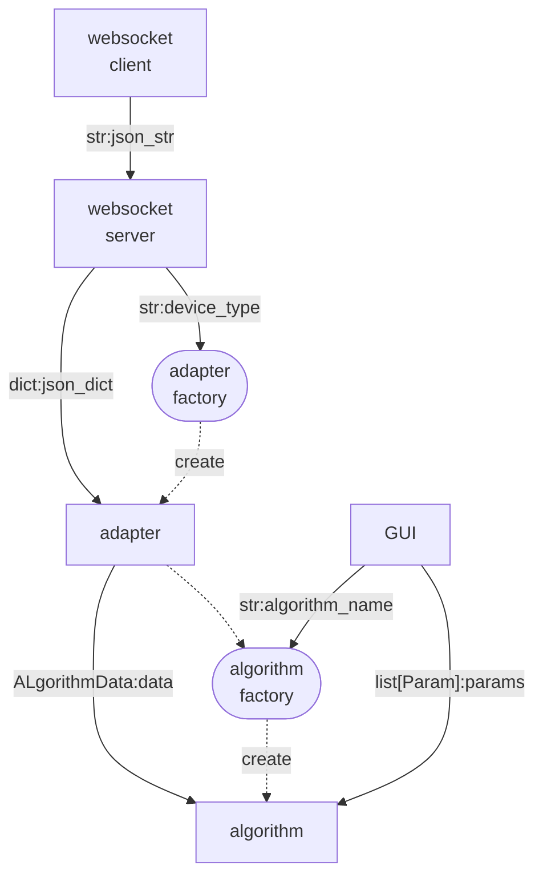
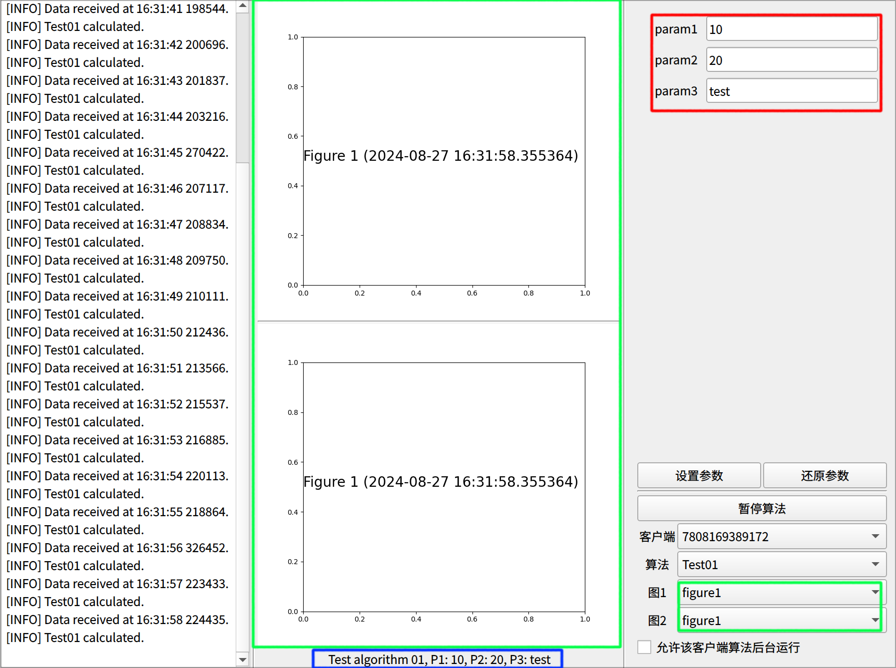

# 使用说明

## 项目安装

### python 环境

本项目使用`python 3.12`进行开发。

推荐使用`python`虚拟环境，以避免不同项目之间的依赖冲突。可以使用`pyenv-virtualenv`或`conda`等工具管理虚拟环境。

这里不再赘述虚拟环境的创建方法，可以参考相关文档：

[conda docs](https://docs.conda.io/projects/conda/en/latest/user-guide/index.html)

[pyenv](https://github.com/pyenv/pyenv)

[pyenv-virtualenv](https://github.com/pyenv/pyenv-virtualenv)

### 依赖安装

本项目依赖`websockets`,`matplotlib`,`pyside6`三个库。推荐直接使用`pip`安装。

```bash
pip install websockets matplotlib pyside6
```

`requirements.txt`文件中包含了所有依赖库，由`pip freeze`生成，所有库版本均指定，若直接安装出现问题可尝试安装`requirements.txt`中的库。

```bash
pip install -r requirements.txt
```

### 运行项目

在`shell`中进入到项目根目录，然后运行以下命令即可启动项目。

```bash
python main.py
```

运行成功后，可以看到如下界面，由于没有设备连接，故界面上没有数据显示。



运行下面的命令开启测试客户端，运行成功后，可以看到界面上的数据显示。

```bash
python ./tests/test_client.py
```



## 项目配置

### 监听地址和端口

程序默认监听`0.0.0.0:2333`端口（即本机所有`ip`的`2333`端口），可以在`main.py`中修改。

```python
from src.app import App

if __name__ == "__main__":
    App.run("0.0.0.0", 2333)   # 修改这里
```

### 项目流程



上图为项目的主要流程（隐藏了一些实现），理解上述流程，可以更好的配置项目，下面将对各个部分进行详细说明。

这里用到了`工厂模式`，最好先对其有一定的了解：[工厂模式介绍](https://www.runoob.com/design-pattern/factory-pattern.html)。

流程图中的实线表示数据流，虚线表示控制流。可以先从数据流开始，然后再看控制流。

**加粗**部分为模块，***斜体***部分为数据。

**数据流：**

1. **下位机**`websocket client`发送 ***json 字符串数据*** `json_str`到**上位机**`websocket server`
2. **上位机**解析 ***json 字符串数据*** 为 python 中的***字典数据*** `json_dict`并传送给**适配器**`adapter`
3. **适配器**将***字典数据*** 解析为***算法数据*** `ALgorithmData`，并传送给**算法**`algorithm`
4. **算法**根据 ***算法数据*** 以及 **GUI** 上的***算法参数*** `params`进行计算

**控制流：**

1. **上位机**转换完数据后，根据***字典数据***中的***设备类型***`device_type`字段创建对应的**适配器**
2. **适配器**拿到对应的**算法工厂**`algorithm factory`
3. **算法工厂**根据**GUI**上的***算法名称***`algorithm_name`创建对应的**算法**

控制流解释了数据流中的**适配器**和**算法**是如何创建的。这种动态的创建方式，使得程序更加灵活，可以根据需要添加新的设备和算法。

### 添加/删除设备

适配器及其工厂在`src/adapter.py`中定义。添加新的设备需要实现一个适配器，然后在`AdapterFactory`中添加对应的设备类型。

下面是适配器接口：

```python
class Adapter(metaclass=ABCMeta):
    @abstractmethod
    def get_algorithm_data(self, msg: dict) -> AlgorithmData:
        pass

    @abstractmethod
    def get_algorithm_factory(self) -> AlgorithmFactory:
        pass
```

适配器类需实现`Adapter`接口，即实现`get_algorithm_data`和`get_algorithm_factory`两个方法。下面是用于测试的适配器实现及ICM20948设备的适配器实现。

```python
class TestAdapter(Adapter):
    def get_algorithm_data(self, msg: dict) -> AlgorithmData:
        return AlgorithmData(cfg=msg["cfg"], data=msg["data"])

    def get_algorithm_factory(self) -> AlgorithmFactory:
        from .algorithm.device.test_device import TestDeviceAlgorithmFactory

        return TestDeviceAlgorithmFactory()

class ICM20948Adapter(Adapter):
    def get_algorithm_data(self, msg: dict) -> AlgorithmData:
        def convert_from_hex(hex_str: str) -> list[int]:
            byte_array = bytearray.fromhex(hex_str)
            return [
                int.from_bytes(byte_array[i : i + 4], "little")
                for i in range(0, len(byte_array), 4)
            ]

        cfg = {
            "accelerate_range": msg["acc_range"],
            "sample_rate": msg["acc_sample_rate"],
            "sample_dots": msg["acc_sample_dots"],
        }
        data = {"data": convert_from_hex(msg["data"])}
        return AlgorithmData(cfg=cfg, data=data)

    def get_algorithm_factory(self) -> AlgorithmFactory:
        from .algorithm.device.icm20948 import ICM20948AlgorithmFactory

        return ICM20948AlgorithmFactory()
```

算法工厂的创建在`get_algorithm_factory`中实现，返回的工厂将用于创建算法。

可以看出算法工厂均`import`自`src.algorithm`中的模块，实现新的适配器时也需要在`src\algorithm\device`中实现对应的算法工厂,并在`get_algorithm_factory`中返回。

具体的算法工厂实现可以参考`src\algorithm\device\test_device.py`和`src\algorithm\device\icm20948.py`，在下面添加\删除算法时会详细说明。

数据的转换在`get_algorithm_data`中实现（如`ICM20948Adapter`中将HEX字符串转换为int列表）,`msg`字典中有什么数据和下位机发送的数据格式有关，需要根据下位机发送的格式进行解析，返回的`AlgorithmData`对象将传递给算法。

适配器工厂如下：

```python
class AdapterFactory:
    @staticmethod
    def get_adapter(device_type: str) -> Adapter:
        if device_type == "Test":
            return TestAdapter()
        if device_type == "ICM20948":
            return ICM20948Adapter()
        else:
            raise ValueError("Unknown device type")
```

添加新的设备时，只需要在`AdapterFactory`中添加对应的`if`并返回对应的适配器即可。

### 添加/删除算法

算法与适配器有关，每个适配器都有一个算法工厂，用于创建算法。添加新的算法需要实现一个算法，并在对应的算法工厂中创建该算法。

下面是算法接口：

```python
class Algorithm(metaclass=ABCMeta):
    @abstractmethod
    def solve(self, data: AlgorithmData, params: dict[str, Param]) -> AlgorithmResult:
        pass

    @abstractmethod
    def get_default_params(self) -> dict[str, Param]:
        pass
```

即实现`Algorithm`接口，实现`solve`和`get_default_params`两个方法。`solve`方法用于计算，`get_default_params`方法用于返回默认的参数。

下面是用于测试的算法实现，来自`src\algorithm\device\test_device.py`。

```python
class TestAlgorithm_01(Algorithm):
    def solve(self, data: AlgorithmData, params: dict[str, Param]) -> AlgorithmResult:
        figure1 = Figure()
        figure2 = Figure()
        figure1.subplots().text(0, 0.5, f"Figure 1 ({datetime.now()})", fontsize=20)
        figure2.subplots().text(0, 0.5, f"Figure 2 ({datetime.now()})", fontsize=20)

        param1 = params["param1"].get_value()
        param2 = params["param2"].get_value()
        param3 = params["param3"].get_value()

        return AlgorithmResult(
            {
                "figure1": figure1,
                "figure2": figure2,
            },
            f"Test algorithm 01, P1: {param1}, P2: {param2}, P3: {param3}",
        )

    def get_default_params(self) -> dict[str, Param]:
        range_checker = RangeChecker(
            min=0,
            max=100,
            left_open=False,
            right_open=False,
        )
        step_checker = StepChecker(step=10)

        return {
            "param1": Param(
                type=IntType(),
                value=10,
                checkers=[
                    range_checker,
                    step_checker,
                ],
            ),
            "param2": Param(
                type=FloatType(),
                value=20,
                checkers=[range_checker],
            ),
            "param3": Param(
                type=StrType(),
                value="test",
                checkers=[
                    SpecificChecker({"test", "test2"}),
                ],
            ),
        }
```

这里先着重介绍一下算法的返回值`AlgorithmResult`数据类，其定义如下：

```python
@dataclass
class AlgorithmResult:
    figure_map: dict[str, Figure]
    text: str
```

其中的`figure_map`用于存放图像，`text`用于存放文本，这两个数据将传递给`GUI`进行显示。`Figure`类来`matplotlib`库，用于绘制图像。matplotlib文档：[matplotlib](https://matplotlib.org/stable/index.html)。

然后介绍算法的参数`Param`类的用法，其中的`type`字段用于指定参数的类型，`value`字段用于指定参数的默认值，`checkers`字段用于指定参数的检查器，检查器用于检查参数的合法性。项目在`src/algorithm/param/param_checker.py`中定义了一些常用的检查器，如果需要其他的检查器，可以在此文件中自行添加。



上图中的红框部分反映了`get_default_params`方法返回值如何反映在 GUI 界面上，`param1`、`param2`、`param3`是参数的名称，即返回值字典中的`key`，输入框中的值默认为`value`字段的值。

绿框和蓝框部分反映了`solve`方法的返回值如何反映在 GUI 界面上，图像名称将添加到右侧绿框对应的下拉框，用于选择中间绿框中的图像（即`figure_map`中对应名称的图像），文本将显示在蓝框中。

下面是测试算法工厂的实现，用于创建测试算法。

```python
class TestDeviceAlgorithmFactory(AlgorithmFactory):
    @staticmethod
    def get_algorithm(algorithm_name: str) -> Algorithm:
        if algorithm_name == "Test01":
            return TestAlgorithm_01()
        if algorithm_name == "Test02":
            return TestAlgorithm_02()
        else:
            raise ValueError("Unknown algorithm name")

    @staticmethod
    def get_algorithm_names() -> list[str]:
        return [
            "Test01",
            "Test02",
        ]
```
添加新的算法时，只需要在`get_algorithm`方法中添加对应的`if`并返回对应的算法，并在`get_algorithm_names`方法中添加算法名称即可。

为其他设备添加算法时或实现新的设备的算法时，原理与上述一致。
